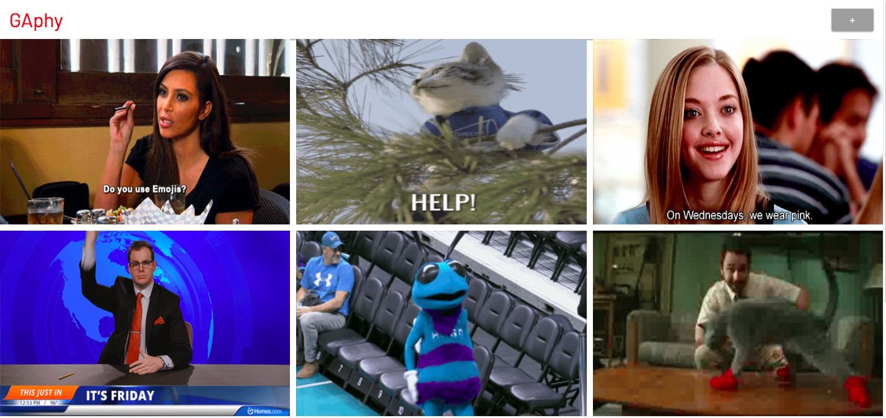

# Express API Lab

For this lab, you will be creating a backend for a completed frontend application. You will be working on an app called "GAphy" which will display a bunch of Gifs. 

The frontend application has full CRUD functionality, your job is to create the backend code to make it functional!

You must create an API that runs at `http://localhost:3000/gifs`. You must have a few different routes:

* GET `/gifs` which will list out all gifs
* POST `/gifs` which will add a new gif and return a list of all gifs
* PUT `gifs/:gifId` which will update a gif and return a list of all gifs
* DELETE `gifs/:gifId` which will delete a gif and return a list of all gifs

You should have your database set up to store a collection of gifs. Your model should have two attributes:
* a `name` for the name of a gif
* a `url` for the url of the gif
If these are named differently, you will have to change the frontend!

You should also set up a seed file to load some default gifs into your database. We recommend using the Giphy site to get gifs. Use the full URL that has the `.gif` file extension (e.g. "https://media.giphy.com/media/3o6ozBUuLfzTCngAFi/giphy.gif").

**Once you have your back end running on `http://localhost:3000/gifs`, open `index.html` on the front end.** (You shouldn't need to edit the front-end code for this to render.)

## Installation
* Fork the repository
* Clone the repository
* Create a directory called `backend` which will hold your backend code
* At the end, submit a pull request with your completed code

## Notes on the Front End
* This app uses primarily vanilla JavaScript for dom manipulation.
* A CSS Framework called materialize is used for the modals. Here JQuery is used to turn them on and off.
* [Axios](https://github.com/axios/axios) is used for AJAX requests.
* Update appears when you click the grey button at the top.
* Edit and delete appear when you click on an image. 

## Bonuses
* Deploy your application to Heroku and GitHub pages.
* Add tagging functionality.
* Add another model to the API. 

## Grading

Your project should have:
* CRUD routes on the application's backend.
* a connected database, with a fully functional model.
* Fully functional frontend code.
* Modularized Express code.
